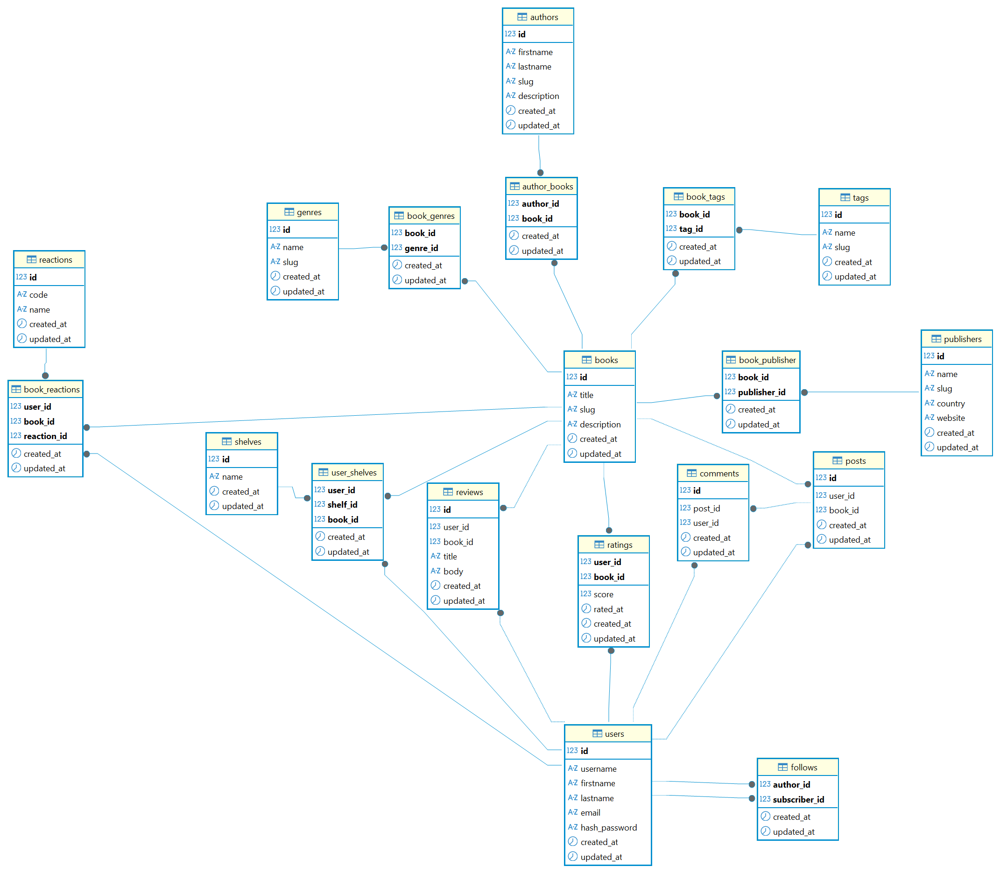

# BookFor

Сервис для чтения электронных книг

## Содержание

- [Описание проекта](#описание-проекта)  
- [Требования](#требования)  
- [Структура репозитория](#структура-репозитория)  
- [Установка и запуск](#установка-и-запуск)  
- [Настройка базы данных](#настройка-базы-данных)  
- [Миграции](#миграции)  
- [Переменные окружения](#переменные-окружения)  
- [API](#api)  
- [ER-диаграмма](#er-диаграмма)

## Описание проекта

BookFor - это REST-сервис для работы с каталогом книг, авторов и жанров, с возможностью:
- Регистрации и аутентификации пользователей (JWT).
- Добавления, просмотра, редактирования и удаления книг, авторов, жанров, издательств, тегов и полок.
- Оценки, отзывов и реакций на книги.
- Подписок на авторов и публикации постов и комментариев.

## Требования

- ### TODO

## Структура репозитория

```
BookFor/
├── src/
│   ├── auth/        
│   ├── books/      
│   ├── core/        
│   ├── genres/     
│   ├── interactions/
│   ├── publishers/
│   ├── shelves/
│   ├── social/
│   ├── tags/
│   └── users/
│   └── main.py      
└── tests/        
```

## Установка и запуск

- ### TODO

## Настройка базы данных

- ### TODO

## Миграции

- ### TODO

## Переменные окружения

- ### TODO

## API

Полная спецификация всех маршрутов находится в файле [API](./docs/API.md).

Возможности API:
- Аутентификация и пользователи
- Книги
- Авторы
- Жанры
- Издатели
- Полки
- Теги
- Взаимодействия с книгой
- Социальные функции

## ER-диаграмма


